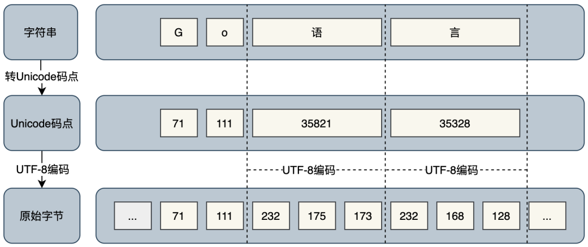

# 1.2 基本数据类型

# 1.2.1 数字

## 1.2.1.1 整型

整型：int，int8，int16，int32，int64，uint，uint8，uint16，uint32，uint64，uintptr。

以 `u` 开头的整型被称为无符号整数类型，即都是非负数。而后面的数字代表这个值在内存中占有多少二进制位。

比如 `uint8` 将占有 8 位，其最大值是 255（即 $2^8 - 1$）。

比如 `int8`，同样占有 8 位，但是最高位是符号位，所以最大值是 127（即 $2^7 -1$），最小值是-128（即$-2^7$）。

以 uint8 举例，为整型赋值时，可以直接使用十六进制、八进制、二进制以及十进制声明。

```shell
// 十六进制
var a uint8 = 0xF
var b uint8 = 0xf

// 八进制
var c uint8 = 017
var d uint8 = 0o17
var e uint8 = 0O17

// 二进制
var f uint8 = 0b1111
var g uint8 = 0B1111

// 十进制
var h uint8 = 15
```

`int`、`uint` 以及 `uintptr` 类型比较特殊，它们的值尺寸**依赖于具体的编译器实现**。

在 64 位的架构上，它们是 64 位的。

而在 32 位的架构上，它们是 32 位的。

## 1.2.1.2 浮点数

浮点数：float32，float64。

`float32` 是单精度浮点数，精确到小数点后 7 位。

`float64` 是双精度浮点数，可以精确到小数点后 15 位。

```shell
var float1 float32 = 10
float2 := 10.0
```

对于浮点类型需要被自动推到的变量，其类型都会被自动设置为 `float64`，而不管它的字面量是否是单精度。

所以用上面的例子再加一行：

```shell
float1 = float2
```

就会有编译错误：

```shell
cannot use float2 (variable of type float64) as float32 value in assignment
```

必须强制类型转换成 float32 才可以编译通过：

```shell
float1 = float32(float2)
```

在实际开发中，也更推荐使用 `float64` 类型，因为官方标准库 `math` 包中，所有有关数学运算的函数的入参都是 `float64` 类型。

复数：complex64，complext128

整型与浮点数日常中常见的数字都是实数，复数是实数的延伸，可以通过两个部分构成，一个实部，一个虚部，常见的声明形式如下：

```shell
var z complex64 = a + bi
```

a 和 b 均为实数，i 为虚数单位，当 b = 0 时，z 就是常见的实数。

当 a = 0 且 b ≠ 0 时，将 z 为纯虚数。

示例

```go
var c1 complex64
c1 = 1.10 + 0.1i
c2 := 1.10 + 0.1i
c3 := complex(1.10, 0.1) // c2与c3是等价的
```

复数类型和浮点型有类似的机制，默认的自动推到的复数类型是 complex128。

并且 Go 还提供了内置函数 real 和 imag，分别获取复数的实部和虚部：

```go
x := real(c2)
y := imag(c2)
```

## 1.2.1.3 byte 类型

`byte` 是 `uint8` 的内置别名，可以把 `byte` 和 `uint8` 视为同一种类型。

在 Go 中，字符串可以直接被转换成 `[]byte`（byte 切片）。

```shell
var s string = "Hello, world!"
var bytes []byte = []byte(s)
fmt.Println("convert \"Hello, world!\" to bytes: ", bytes)
```

同时[]byte 也可以直接转换成 string。

```shell
var bytes []byte = []byte{72, 101, 108, 108, 111, 44, 32, 119, 111, 114, 108, 100, 33}
var s string = string(bytes)
fmt.Println(s)
```

## 1.2.1.4 rune 类型

`rune` 是 `int32` 的内置别名，可以把 `rune` 和 `int32` 视为同一种类型。但 rune 是特殊的整数类型。

在 Go 中，一个 rune 值表示一个 Unicode 码点。一般情况下，一个 Unicode 码点可以看做一个 Unicode 字符。有些比较特殊的 Unicode 字符有多个 Unicode 码点组成。

一个 rune 类型的值由一个个被单引号包住的字符组成，比如：

```shell
var r1 rune = 'a'
var r2 rune = '世'
```

字符串可以直接转换成 `[]rune`（rune 切片）。

```shell
var s string = "abc，你好，世界！"
var runes []rune = []rune(s)
```

# 1.2.2 字符串 - string

在 Go 中，字符串是 UTF-8 编码的，并且所有的 Go 源码都必须是 UTF-8 编码。

字符串的字面量有两种形式。

一种是解释型字面表示（interpreted string literal，双引号风格）。

```shell
var s string = "Hello\nworld!\n"
```

另一种是直白字面量表示（raw string literal， 反引号风格）。

```shell
var s string = `Hello
world!
`
```

上面举例的两种字符串是等价的：

```shell
var s1 string = "Hello\nworld!\n"
var s2 string = `Hello
world!
`
fmt.Println(s1 == s2)
```

输出的结果为 true。

## 1.2.2.1 byte、rune 与 string 之间的联系

通过上面的介绍，可以知道[]byte、[]rune 和 string 之间是可以相互转换的：

```shell
var s string = "Go语言"
var bytes []byte = []byte(s)
var runes []rune = []rune(s)

fmt.Println("string length: ", len(s))
fmt.Println("bytes length: ", len(bytes))
fmt.Println("runes length: ", len(runes))
```

输出结果：

```shell
string length:  8
bytes length:  8
runes length:  4
```

也就是说直接获取字符串的长度是把字符串转换成 `[]byte` 之后 `[]byte` 的长度。

而字符串转换成[]rune，[]rune 的长度则是字符串字符的长度。

按照输出的长度截取字符串：

```shell
var s string = "Go语言"
    var bytes []byte = []byte(s)
    var runes []rune = []rune(s)

    fmt.Println("string sub: ", s[0:7])
    fmt.Println("bytes sub: ", string(bytes[0:7]))
    fmt.Println("runes sub: ", string(runes[0:3]))
```

输出结果：

```shell
string sub:  Go语�
bytes sub:  Go语�
runes sub:  Go语
```

当截取的位置不当，字符串会出现乱码。

当字符串转换成[]rune 后，直接截去最后一位，能正确的把最后一个符号去掉。

在 Go 中，字符串是由单个字节组成的不可修改的字节序列。字节使用 UTF-8 编码表示 Unicode 文本。

也就是说 `.go` 文件可以包含 Unicode 支持的任意字符，并且在任意系统上打开都不会乱码。

且 Go 语言把字符分为 byte 和 rune 两种类型处理。

byte 是类型 uint8 的别名，用于存放 1 字节的 `ASCII` 字符，比如英文字符、数字等，返回的是字符的原始字节。

rune 是类型 int32 的别名，用于存放多字节字符，比如占 3 字节的中文字符，返回的是 Unicode 码点值。

对应关系如下图所示：



# 1.2.3 布尔类型 - bool

在 Go 语言中，布尔类型用于表示真（true）和假（false）两种逻辑值。

可以使用逻辑运算符和比较运算符来生成布尔值。

# 1.2.4 零值

Go 中每种类型都有一个零值，一个类型的零值可以看成此类型的默认值，当一个类型的变量没有被初始化时，其值就是默认值。

数字类型的零值都是 0。

字符串类型的零值是空字符串。

布尔类型的零值是 false。
