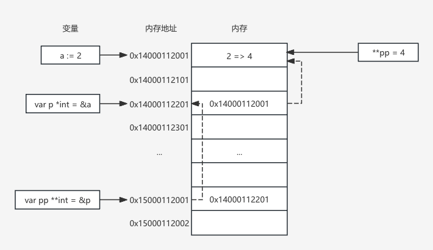

# 1.4 指针

Go 中，指针是一个变量，它存储了另一个变量的内存地址。

通过指针，可以访问存储在指定内存地址中的数据。

# 1.4.1 指针声明与初始化

在 Go 中，声明一个指针类型变量需使用星号 `*` 标识：

```go
var <name> *<type>
```

初始化指针必须通过另外一个变量， 如果没有赋值：

```go
p = &<var name>
```

也可以使用一个结构体实例或者变量直接声明并且赋值给一个指针：

```go
p := &<struct type>{}
p := &<var name>
```

同时还可以获取指针的指针：

```go
var p **<type>
```

代码示例：

```go
var p1 *int
var p2 *string

i := 1
s := "Hello"
// 基础类型数据，必须使用变量名获取指针，无法直接通过字面量获取指针
// 因为字面量会在编译期被声明为成常量，不能获取到内存中的指针信息
p1 = &i
p2 = &s

p3 := &p2
fmt.Println(p1)
fmt.Println(p2)
fmt.Println(p3)
```

注 1：指针也是有零值的，它的零值是 nil。如果只是声明一个指针，`var p *<type>`，那么这个指针就是 nil，是不能通过这个指针获取数据的，必须对这个指针赋值之后，才可以访问指针指向的值。

注 2：指针不能直接计算，不能像 C/C++ 中一样，直接对指针作加减操作，达到偏移访问的目的。在 Go 中，如果对指针做计算操作，会直接报错，无法完成编译。

# 1.4.2 使用指针访问值

使用星号引用指针来访问指针指向的值：

```go
<name1> <type1> = *p
<name2> := *p
```

除了访问值以外，同样可以通过指针修改原始变量的值。

代码示例：

```go
var p1 *int
i := 1
p1 = &i
fmt.Println(*p1 == i)
*p1 = 2
fmt.Println(i)
```

# 1.4.3 修改指针指向的值

代码示例：

```go
a := 2
var p *int
fmt.Println(&a)
p = &a
fmt.Println(p, &a)

var pp **int
pp = &p
fmt.Println(pp, p)
**pp = 3
fmt.Println(pp, *pp, p)
fmt.Println(**pp, *p)
fmt.Println(a, &a)
```

上面代码的操作示意图：



指针变量，同样和普通变量一样，会持有一个内存地址，内存地址对应的内存区域中保存的数据是另外一个变量的内存地址。

当使用*p 时，就是利用保存的这个内存地址访问到了实际的内存区域中的数据。

另外指针变量本身也是变量，也就同样可以把指针变量的内存地址赋值给另外一个指针，所以就有了 `**<type>`（指针的指针），并且这个模式理论上是可以一直循环，Go 并没有对这种情况加以限制。

当对 *p 重新赋值时，修改的是其指向的内存区域中的数据，所以不管是修改* p 的值还是**pp 的值，最终都会让变量 a 的值被修改。

# 1.4.4 指针、unsafe.Pointer 和 uintptr

在 Go 中，指针不能直接参与计算，否则会在编译的时候就包错：

```go
var a int
var p *int
p = &a
p = p + 1
fmt.Println(p)
```

输出错误信息：

```go
invalid operation: p + 1 (mismatched types *int and untyped int)
```

但是 Go 中提供了其他方式，来操作指针，即引入了 unsafe.Point 类型和 uintptr 类型，来帮助我们操作指针。

uintptr 类型是把内存地址转换成了一个整数，然后对这个整数进行计算后，在把 uintptr 转换成指针，达到指针偏移的效果。

unsafe.Pointer 是普通指针与 uintptr 之间的桥梁，通过 unsafe.Pointer 实现三者的相互转换。

```go
*T <---> unsafe.Pointer <---> uintptr
```

把指针转换成 unsafe.Pointer:

```go
var p *<type>
var a <type>
p = &a

up1 := unsafe.Pointer(p)
up2 := unsafe.Pointer(&a)
```

把 unsafe.Pointer 转成 uintptr

```go
uintpr = uintptr(up1)
```

代码示例：

```go
a := "Hello, world!"
upA := uintptr(unsafe.Pointer(&a))
upA += 1

c := (*uint8)(unsafe.Pointer(upA))
fmt.Println(*c)
```

注意，这个操作非常危险，并且结果不可控，在一般情况下是不需要进行这种操作。
